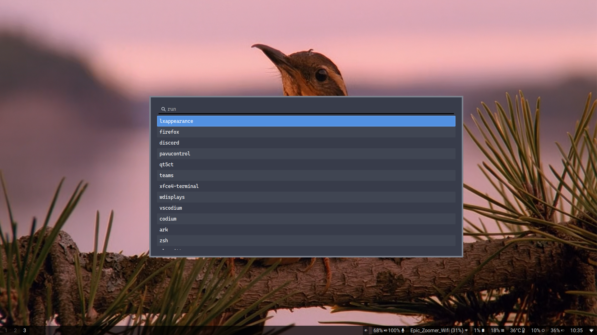

[English](README.md) | [Français](README.fr.md)

# wofi-arc-dark

Une feuille de style qui reproduit le thème arc-dark pour wofi.

## Aperçu

## Installation

Copiez le fichier `style.css` dans le dossier `$XDG_CONFIG_HOME/wofi` (probablement `$HOME/.config/wofi`).

## Star History

